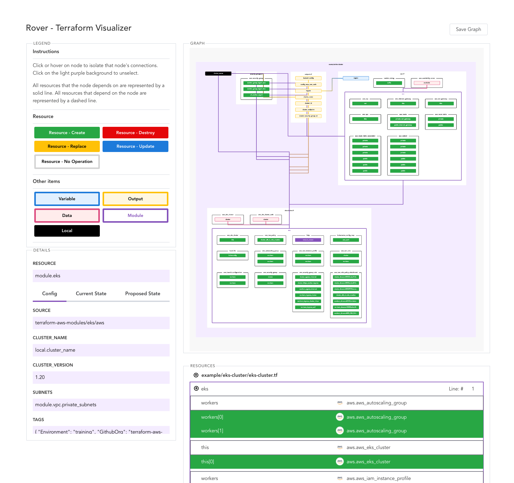

# Rover - Terraform Visualizer

Rover is a [Terraform](http://terraform.io/) visualizer.

In order to do this, Rover:

1. generates a [`plan`](https://www.terraform.io/docs/cli/commands/plan.html#out-filename) file and parses the configuration in the root directory or uses a provided plan.
1. parses the `plan` and configuration files to generate three items: the resource overview (`rso`), the resource map (`map`), and the resource graph (`graph`).
1. consumes the `rso`, `map`, and `graph` to generate an interactive configuration and state visualization hosts on `0.0.0.0:9000`.

Feedback (via issues) and pull requests are appreciated!



## Quickstart

The fastest way to get up and running with Rover is through Docker.

Run the following command in any Terraform workspace to generate a visualization. This command copies all the files in your current directory to the Rover container and exposes port `:9000`.

```
$ docker run --rm -it -p 9000:9000 -v $(pwd):/src im2nguyen/rover
2021/07/02 06:46:23 Starting Rover...
2021/07/02 06:46:23 Initializing Terraform...
2021/07/02 06:46:24 Generating plan...
2021/07/02 06:46:25 Parsing configuration...
2021/07/02 06:46:25 Generating resource overview...
2021/07/02 06:46:25 Generating resource map...
2021/07/02 06:46:25 Generating resource graph...
2021/07/02 06:46:25 Done generating assets.
2021/07/02 06:46:25 Rover is running on 0.0.0.0:9000
```

Once Rover runs on `0.0.0.0:9000`, navigate to it to find the visualization!

### Standalone mode

Standalone mode generates a `rover.zip` file containing all the static assets.

```shell
$ docker run --rm -it -p 9000:9000 -v $(pwd):/src im2nguyen/rover -standalone true
```

After all the assets are generated, unzip `rover.zip` and open `rover/index.html` in your favourite web browser.

### Set environment variables

Use `--env` or `--env-file` to set environment variables in the Docker container. For example, you can save your AWS credentials to a `.env` file.

```shell
$ printenv | grep "AWS" > .env
```

Then, add it as environment variables to your Docker container with `--env-file`.

```shell
$ docker run --rm -it -p 9000:9000 -v $(pwd):/src --env-file ./.env im2nguyen/rover
```

## Define tfbackend, tfvars and Terraform variables

Use `-tfBackendConfig` to define backend config files and `-tfVarsFile` or `-tfVar` to define variables. For example, you can run the following in the `example/random-test` directory to overload variables.

```shell
$ docker run --rm -it -p 9000:9000 -v $(pwd):/src im2nguyen/rover -tfBackendConfig test.tfbackend -tfVarsFile test.tfvars -tfVar max_length=4
```

## Installation

You can download Rover binary specific to your system by visiting the [Releases page](https://github.com/im2nguyen/rover/releases). Download the binary, unzip, then move `rover` into your `PATH`.

- [rover zip — MacOS](https://github.com/im2nguyen/rover/releases/download/v0.1.3/rover_0.1.3_darwin_amd64.zip)
- [rover zip — Windows](https://github.com/im2nguyen/rover/releases/download/v0.1.3/rover_0.1.3_windows_amd64.zip)

### Build from source

You can build Rover manually by cloning this repository, then building the frontend and compiling the binary. It requires Go v1.16+ and `npm`.

#### Build frontend

First, navigate to the `ui`.

```shell
$ cd ui
```

Then, install the dependencies.

```shell
$ npm install
```

Finally, build the frontend.

```shell
$ npm run build
```

#### Compile binary

Navigate to the root directory.

```shell
$ cd ..
```

Compile and install the binary. Alternatively, you can use `go build` and move the binary into your `PATH`.

```shell
$ go install
```

## Basic usage

This repository contains two examples of Terraform configurations in `example`.

Navigate into `random-test` example configuration. This directory contains configuration that showcases a wide variety of features common in Terraform (modules, count, output, locals, etc) with the [`random`](https://registry.terraform.io/providers/hashicorp/random/latest) provider.

```shell
$ cd example/random-test
```

Run Rover. Rover will start running in the current directory and assume the Terraform binary lives in `/usr/local/bin/terraform` by default.

```shell
$ rover
2021/06/23 22:51:27 Starting Rover...
2021/06/23 22:51:27 Initializing Terraform...
2021/06/23 22:51:28 Generating plan...
2021/06/23 22:51:28 Parsing configuration...
2021/06/23 22:51:28 Generating resource overview...
2021/06/23 22:51:28 Generating resource map...
2021/06/23 22:51:28 Generating resource graph...
2021/06/23 22:51:28 Done generating assets.
2021/06/23 22:51:28 Rover is running on 0.0.0.0:9000
```

You can specify the working directory (where your configuration is living) and the Terraform binary location using flags.

```shell
$ rover -workingDir "example/eks-cluster" -tfPath "/Users/dos/terraform"
```

Once Rover runs on `0.0.0.0:9000`, navigate to it to find the visualization!


## Container image

Everything is dockerized and handled by [buildx bake](docker-bake.hcl) for an agnostic usage of this repo:

There are two varient of image

1. Simple: typically fat image

- e.g., `docker run --rm -it -p 9000:9000 -v $(pwd):/src im2nguyen/rover`

2. Slim: rover and terraform compressed by [UPX](https://github.com/upx/upx)

- e.g., `docker run --rm -it -p 9000:9000 -v $(pwd):/src im2nguyen/rover:slim`

> Create docker buildx builder when first time using
> ```docker buildx create --use```

```shell
git clone --depth 1 https://github.com/im2nguyen/rover.git rover
cd rover

## Create local image
docker buildx bake

## Create local slim image
docker buildx bake slim

## build multi-platform image
docker buildx bake image-all-arch

## build multi-platform slim image
docker buildx bake image-slim

```

Multi-platform create container image for these platforms
   - linux
     - amd64
     - 386
     - arm64
     - arm

You can override args and tags with envs

- Args:

  - `GO_VERSION`:    Golang version

  - `NODE_VERSION`:  Node version

  - `TF_VERSION`:    Terraform version
- Tags:

   It accepts comma seprated values e.g. `export TAGS='im2nguyen/rover:latest,im2nguyen/rover:test'`.

   - `TAGS` for image

   - `TAGS_SLIM` for slim image

    Default image tags are

     - `im2nguyen/rover:edge`
     - `im2nguyen/rover:latest`
     - `im2nguyen/rover:edge-0000000`

    For slim image
     - `im2nguyen/rover:slim`
     - `im2nguyen/rover:slim-edge`
     - `im2nguyen/rover:slim-latest`
     - `im2nguyen/rover:slim-edge-0000000`

- OR you can override individual env also
    - `REPO`:     for repository
    - `VERSION`:  for version of project
    - `GIT_SHA`:  for git ref

  That will form tags like this
   - `${REPO}:latest`
   - `${REPO}:${VERSION}`
   - `${REPO}:${VERSION}-${GIT_SHA}`

   For slim
   - `${REPO}:slim`
   - `${REPO}:slim-latest`
   - `${REPO}:slim-${VERSION}`
   - `${REPO}:slim-${VERSION}-${GIT_SHA}`

## Compile binary (through docker)

Binaries will be exported to `.dist` directory

```shell
## Create binary for local platform
docker buildx bake artifact

## Create binaries for all platform
docker buildx bake artifact-slim

## Create slim binaries for all platform
docker buildx bake artifact-all
```

All plateforms covers in both binary and archive format
  - linux
    - amd64
    - 386
    - arm64
    - arm
  - freebsd
    - amd64
    - 386
    - arm64
    - arm
  - windows
    - amd64
    - arm64
    - arm
    - 386
  - darwin
    - amd64
    - arm64
